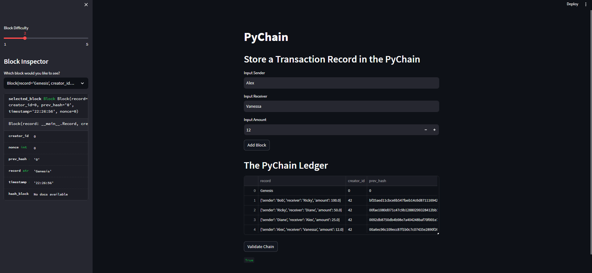

# Module-18-Assignment - PyChain

### by Alex Melino

#

## Assignment Overview

This assignment covers the creation of a simple python-based blockchain which uses the application Streamlit as a web-based interface for adding blocks and visualizing the blockchain.

The python code is contained in the file *'pychain.py'*. The code includes the creation of multiple classes ('Record', 'Block', and 'PyChain') whcih define the structure of the blocks and blockchain. Following that is the code which relates to the Streamlit app itself, setting up the user-intreface and visualization.

The app takes in input from the user for a 'Sender', 'Receiver', and 'Amount'. When executed, the python program adds that info as the next block in the blockchain. The data from any entered block can be reviewed by the user in the sidebar of the application.

This repo uses the following libraries and imports: pandas, hashlib, Streamlit, dataclasses, datetime, and typing.

Below are screenshots from the Streamlit application showing three added blocks. These screenshots can be found in the *'Images'* folder of this repo.

#

#

#

